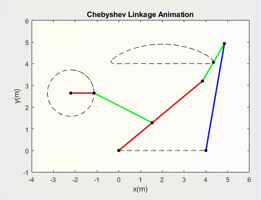

# Chebyshev Linkage

This project cosists of a MATLAB code that crate an animation of Chebyshev linkage movement. The Chebyshev linkage is a mechanical linkage designed to convert rotational motion to approximate straight-line motion.

The code is formed by four main sections. The first one uses Chebyshev link lengths to design a secondary mechanism, which has the function of transfer the rotational motion in the appropriate inlet movement of the main linkage. The second part calculate the movement of secondary linkage by the inlet angular velocity defined. The third part uses the output movement of the secondary mechanism to calculate the evolution of the Chebyshev linkage in time. Finally, the last part combine all link movements to plot and generate a MP4 video of the animation.

