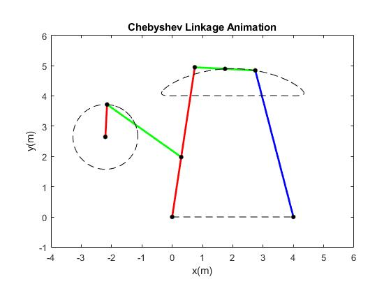

# Chebyshev Linkage

This project cosists of a MATLAB code that crate an animation of Chebyshev linkage movement. The Chebyshev linkage is a mechanical linkage designed to convert rotational motion to approximate straight-line motion.

The code is formed by four main sections. The first one uses Chebyshev link lengths to create a secondary mechanism to transfer the rotational motion in the appropriate inlet movemente of the main mechanism. The second part define the movement of secondary linkage in time and angular velocity defined. The third part uses the output movement of the secondary linkage to calculate the evolution of the Chebyshev linkage movement. Finally, the last part combine all the link movements to plot and generate a MP4 video of the animation.

